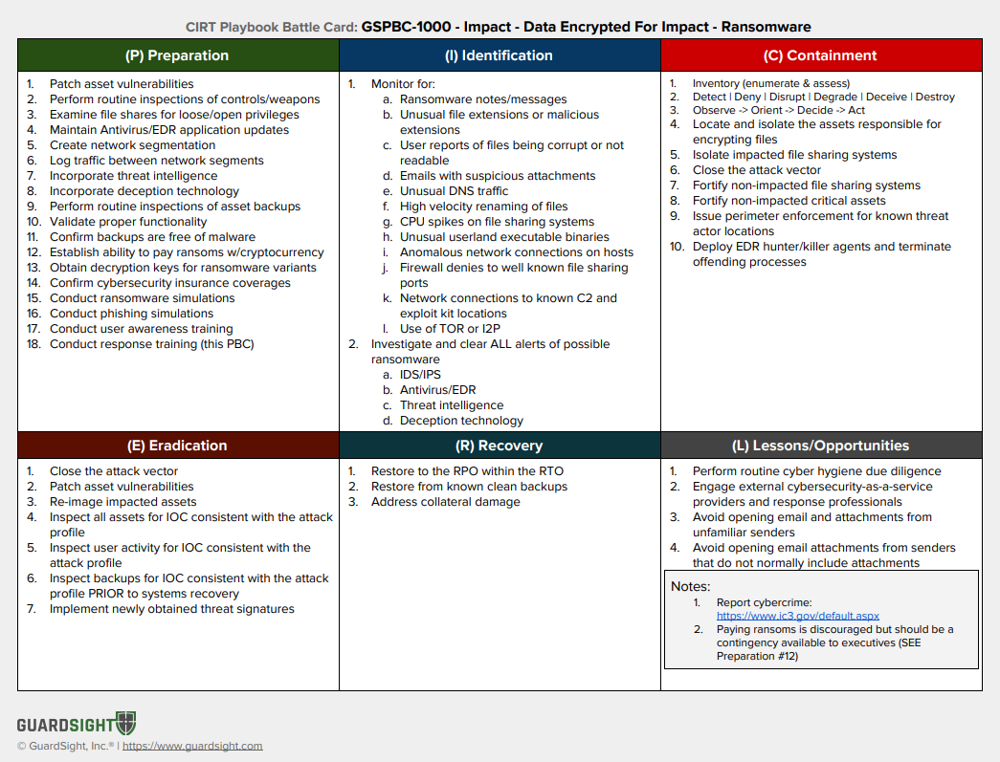

## A collection of Cyber Incident Response Playbook Battle Cards

1. Playbook Battle Cards (PBC) are recipes for preparing and applying countermeasures against cyber threats and attacks
2. PBC are a prescriptive approach to managing various [TTP](https://attack.mitre.org/tactics/enterprise/) deployed by cyber threat actors
3. PBC follow a [PICERL](https://www.sans.org/media/score/504-incident-response-cycle.pdf) model
4. PBC aid the kinetic activities conducted by humans prior to, during, and after cybersecurity incident response
5. PBC are inspired by https://github.com/certsocietegenerale/IRM/

# SEE ALSO
1. https://github.com/certsocietegenerale/IRM/
2. https://www.incidentresponse.com/playbooks/
3. https://www.nist.gov/cyberframework
4. https://nvlpubs.nist.gov/nistpubs/SpecialPublications/NIST.SP.800-184.pdf
5. https://csrc.nist.gov/publications/detail/sp/800-61/rev-2/final
6. https://www.mitre.org/sites/default/files/publications/pr_14-3929-cyber-exercise-playbook.pdf
